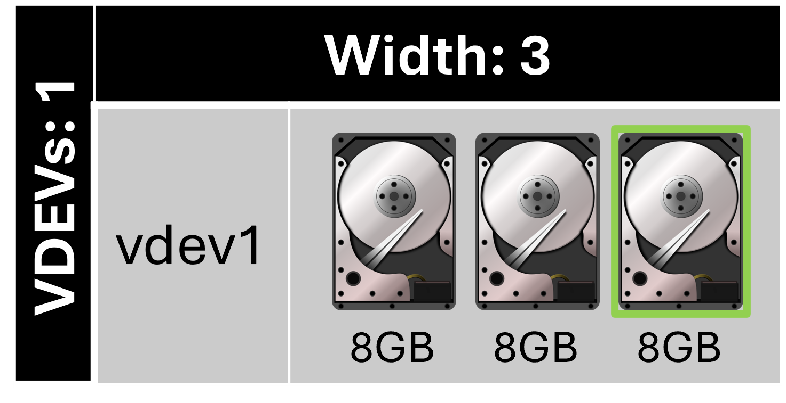
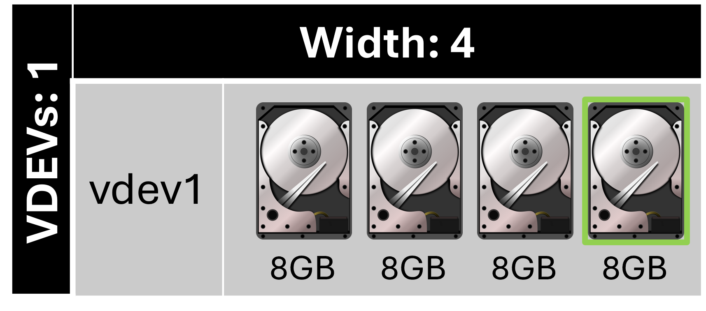
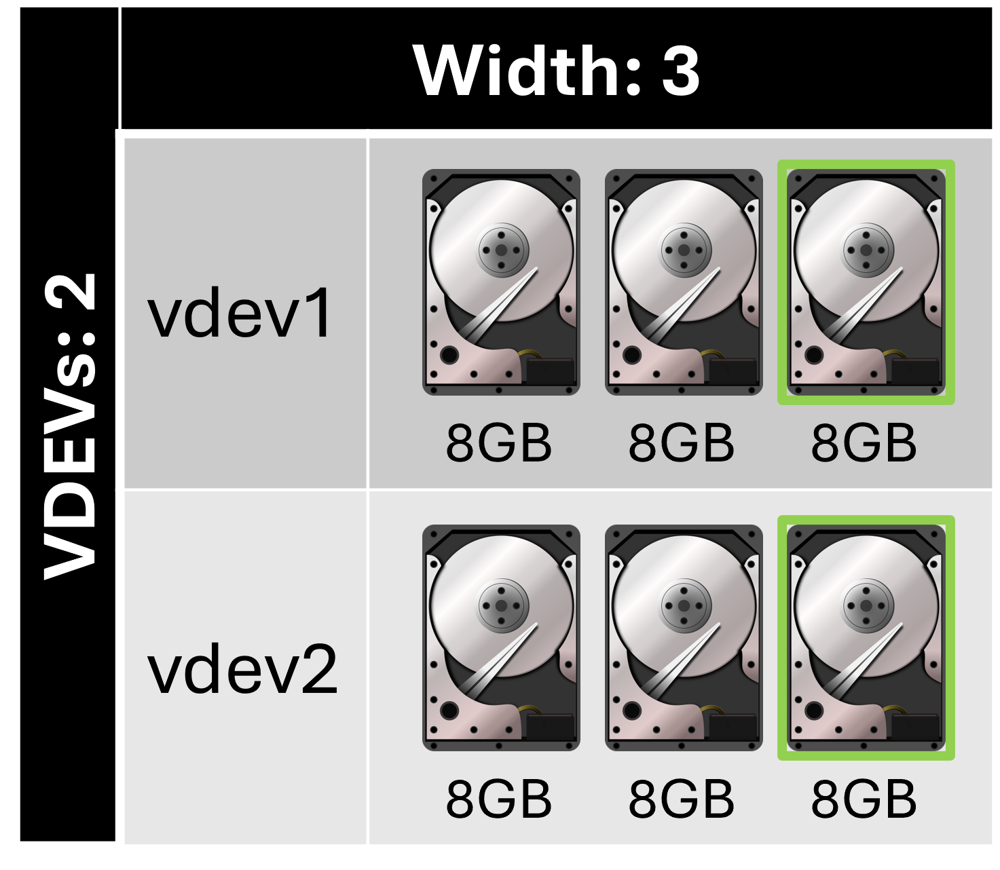

# TrueNAS Scale: Configure RAIDZ1 disk layout vdev

<b>Description:</b>

Uses one disk for parity while all other disks store data. RAIDZ1 requires at least three disks. RAIDZ is a traditional ZFS data protection scheme.

<b>Requirements:</b>

* Atleast 3 disks

<b>Provides:</b>

* Least redundancy per vdev compared to other RAIDZ layout
* Most capacity per vdev compared to other RAIDZ layout

<b>Example 1:</b>

<b>Configuration:</b>

* Width: 3
* Number of VDEVs: 1
* Total drives: 3
* Drive capacity: 8 GB
* Total capacity: 16 GB
* Redundancy: 1 drive

<b>Example 2:</b>

<b>Configuration:</b>

* Width: 4
* Number of VDEVs: 1
* Total drives: 4
* Drive capacity: 8 GB
* Total capacity: 24 GB
* Redundancy: 1 drive

<b>Example 3:</b>

<b>Configuration:</b>

* Width: 3
* Number of VDEVs: 2
* Total drives: 6
* Drive capacity: 8 GB
* Total capacity: 32 GB
* Redundancy: 1 drive per vdev