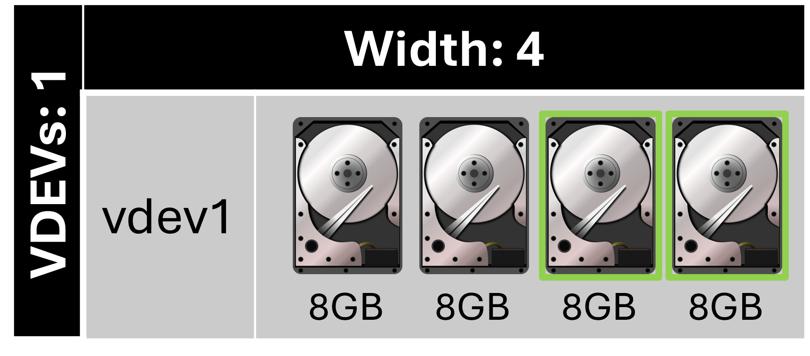
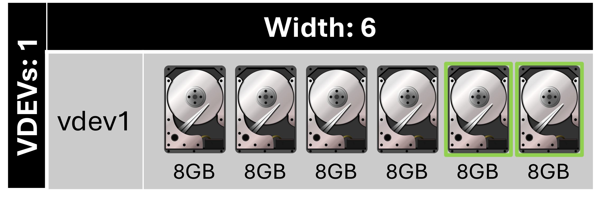
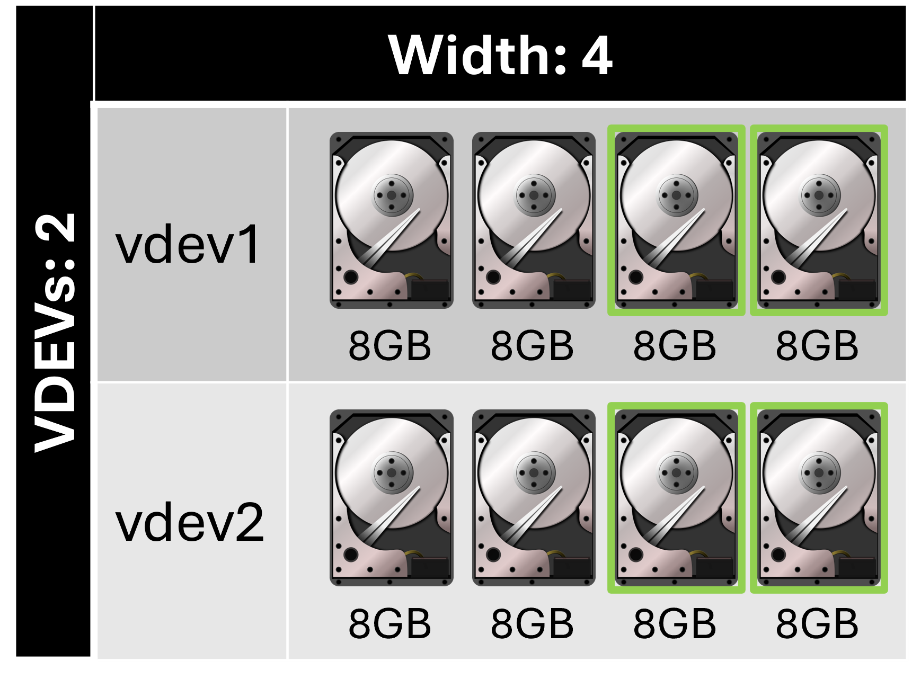
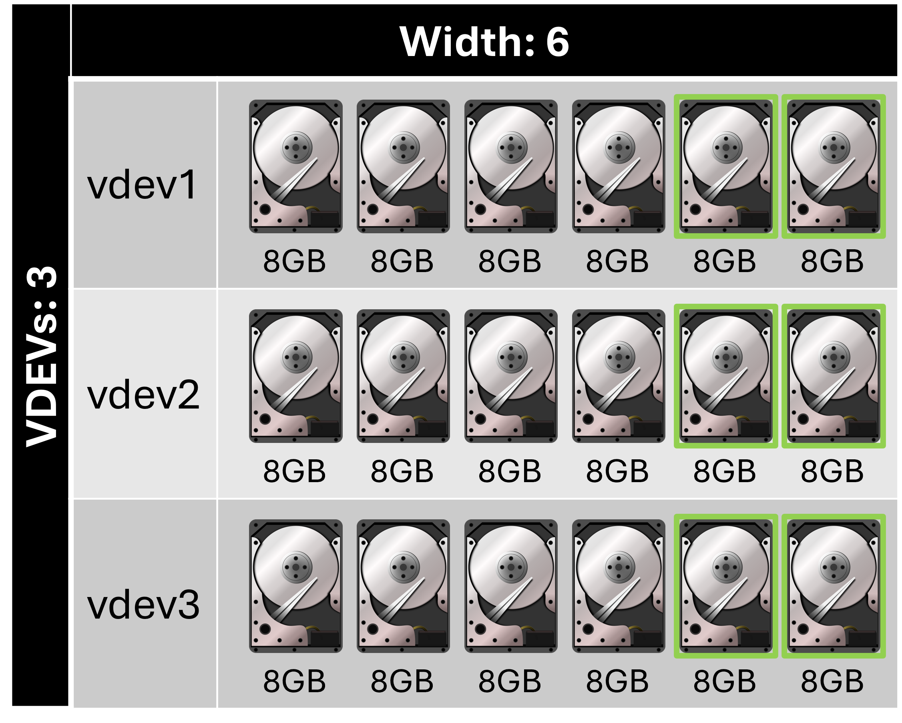

# TrueNAS Scale: Configure RAIDZ2 layout vdev disk pool

<b>Description:</b>

Uses two disks for parity while all other disks store data. RAIDZ2 requires at least four disks. RAIDZ is a traditional ZFS data protection scheme.

<b>Requirements:</b>

* Atleast 4 disks

<b>Provides:</b>

* Medium redundancy per vdev compared to other RAIDZ layouts
* Medium capacity per vdev compared to other RAIDZ layouts

<b>Example 1:</b>

<b>Configuration:</b>

* Width: 4
* Number of VDEVs: 1
* Total drives: 4
* Drive capacity: 8 GB
* Total capacity: 16 GB
* Redundancy: 2 drives

<b>Example 2:</b>

<b>Configuration:</b>

* Width: 6
* Number of VDEVs: 1
* Total drives: 6
* Drive capacity: 8 GB
* Total capacity: 32 GB
* Redundancy: 2 drives

<b>Example 3:</b>

<b>Configuration:</b>

* Width: 4
* Number of VDEVs: 2
* Total drives: 8
* Drive capacity: 8 GB
* Total capacity: 32 GB
* Redundancy: 4 drives, 2 drives per vdev

<b>Example 4:</b>

<b>Configuration:</b>

* Width: 6
* Number of VDEVs: 3
* Total drives: 18
* Drive capacity: 8 GB
* Total capacity: 96 GB
* Redundancy: 6 drives, 2 drives per vdev

# Related videos:

* [TrueNAS Scale playlist](https://www.youtube.com/playlist?list=PLVncjTDMNQ4RKprjwzLtGYUwVLZe6INiH)