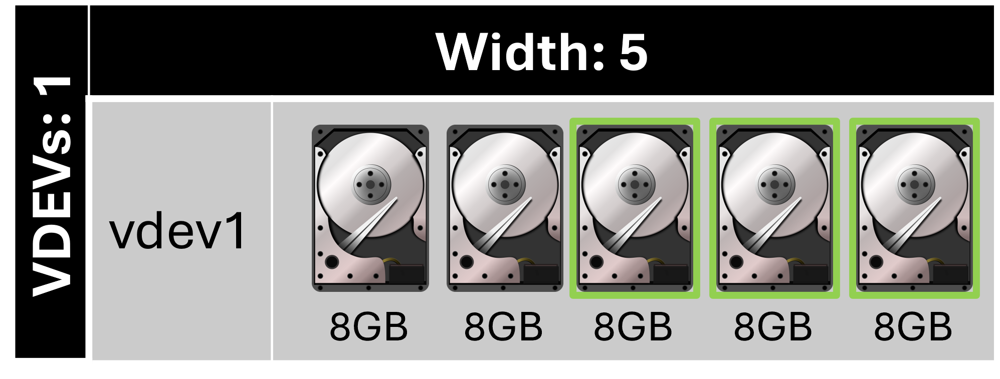
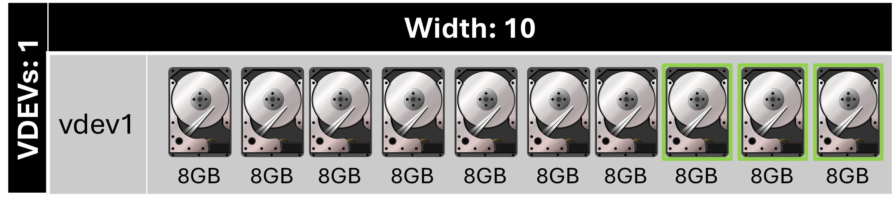
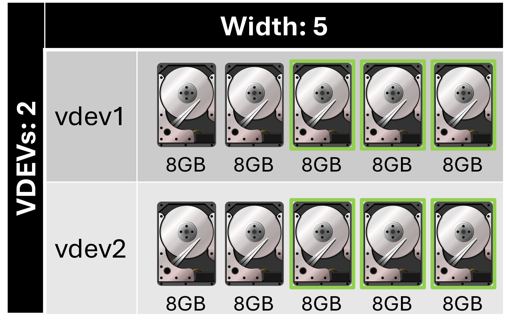
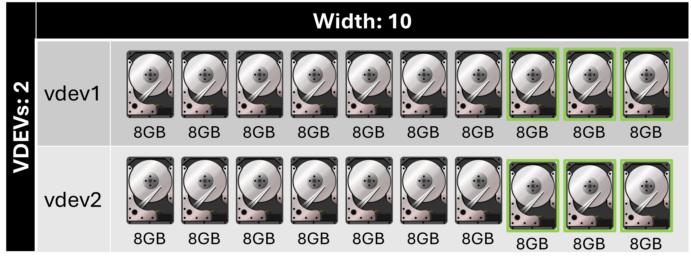

# TrueNAS Scale: Configure RAIDZ3 layout vdev disk pool

<b>Description:</b>

Uses three disks for parity while all other disks store data. RAIDZ3 requires at least five disks. RAIDZ is a traditional ZFS data protection scheme.

<b>Requirements:</b>

* Atleast 5 disks

<b>Provides:</b>

* Maximum redundancy per vdev compared to other RAIDZ layouts
* Lowest capacity per vdev compared to other RAIDZ layouts

<b>Example 1:</b>

<b>Configuration:</b>

* Width: 5
* Number of VDEVs: 1
* Total drives: 5
* Drive capacity: 8 GB
* Total capacity: 16 GB
* Redundancy: 3 drives

<b>Example 2:</b>

<b>Configuration:</b>

* Width: 10
* Number of VDEVs: 1
* Total drives: 10
* Drive capacity: 8 GB
* Total capacity: 56 GB
* Redundancy: 3 drives

<b>Example 3:</b>

<b>Configuration:</b>

* Width: 5
* Number of VDEVs: 2
* Total drives: 10
* Drive capacity: 8 GB
* Total capacity: 32 GB
* Redundancy: 6 drives, 3 drives per vdev

<b>Example 4:</b>

<b>Configuration:</b>

* Width: 10
* Number of VDEVs: 2
* Total drives: 20
* Drive capacity: 8 GB
* Total capacity: 112 GB
* Redundancy: 6 drives, 3 drives per vdev

# Related videos:

* [TrueNAS Scale playlist](https://www.youtube.com/playlist?list=PLVncjTDMNQ4RKprjwzLtGYUwVLZe6INiH)