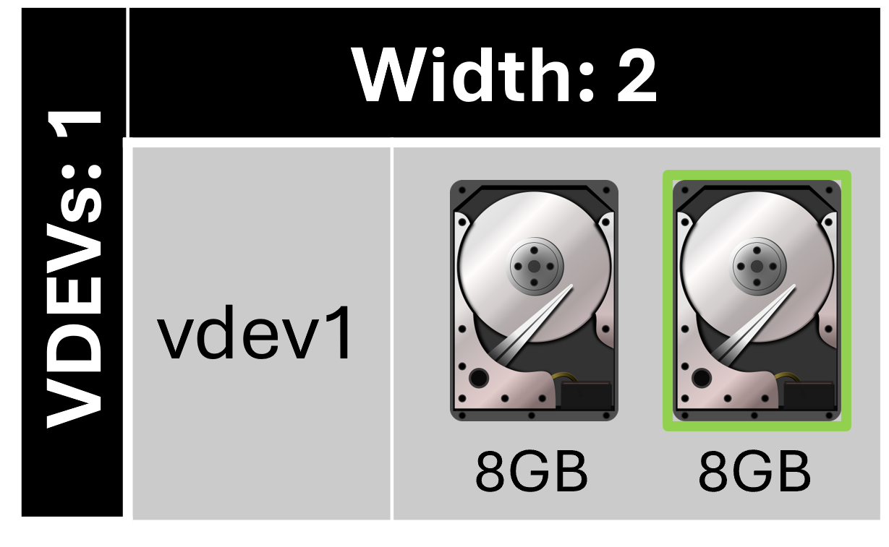
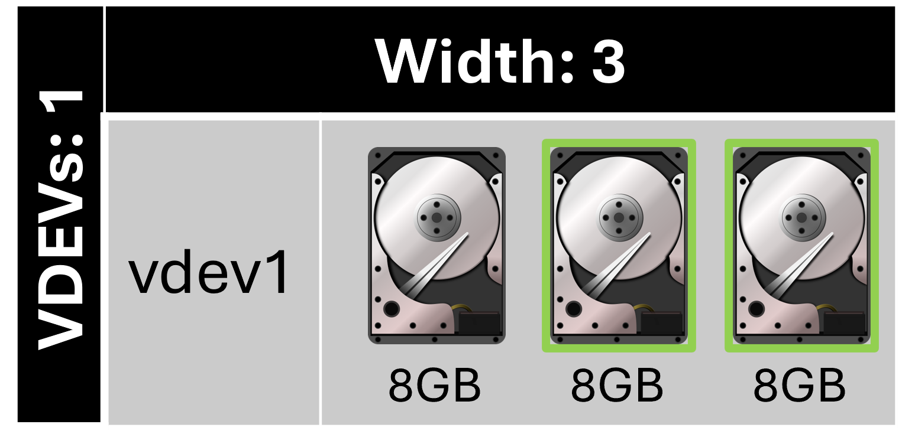
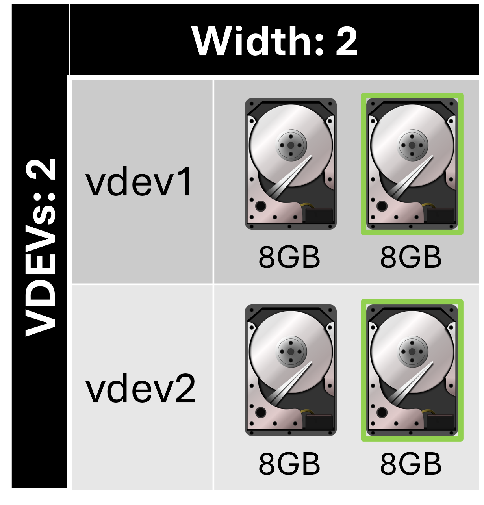

# TrueNAS Scale: Configure mirror disk layout vdev

<b>Description:</b>

Data is identical in each disk. A mirror requires at least two disks, provides the most redundancy, and has the least capacity

<b>Requirements:</b>

* Atleast 2 disks

<b>Provides:</b>

* Most redundancy
* Least capacity

<b>Example 1:</b>

<b>Configuration:</b>

* Width: 2
* Number of VDEVs: 1
* Total drives: 2
* Drive capacity: 8 GB
* Total capacity: 8 GB
* Redundancy: 1 drive

<b>Example 2:</b>

<b>Configuration:</b>

* Width: 3
* Number of VDEVs: 1
* Total drives: 2
* Drive capacity: 8 GB
* Total capacity: 8 GB
* Redundancy: 2 drives

<b>Example 3:</b>

<b>Configuration:</b>

* Width: 2
* Number of VDEVs: 2
* Total drives: 4
* Drive capacity: 8 GB
* Total capacity: 16 GB
* Redundancy: 2 drives 1 in each vdev