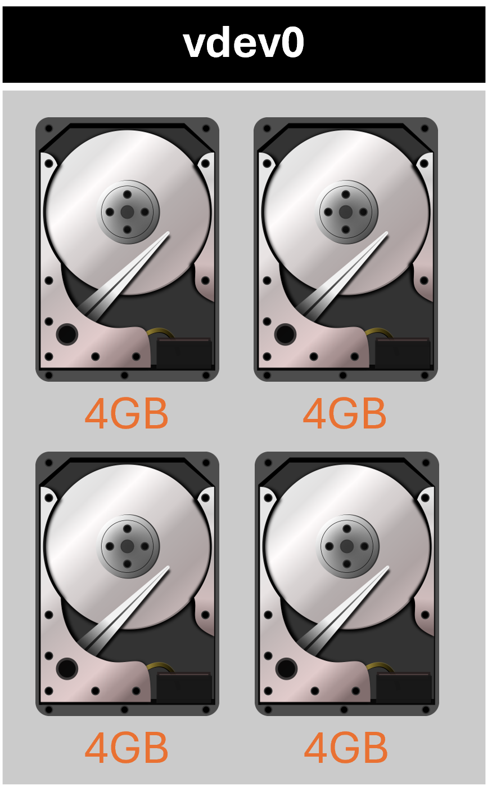
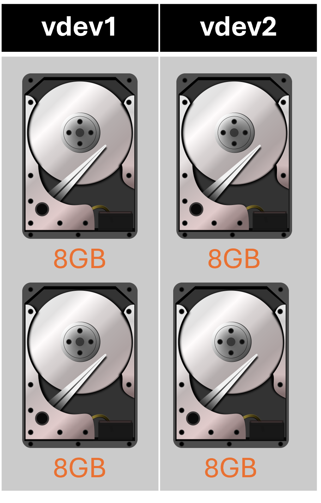
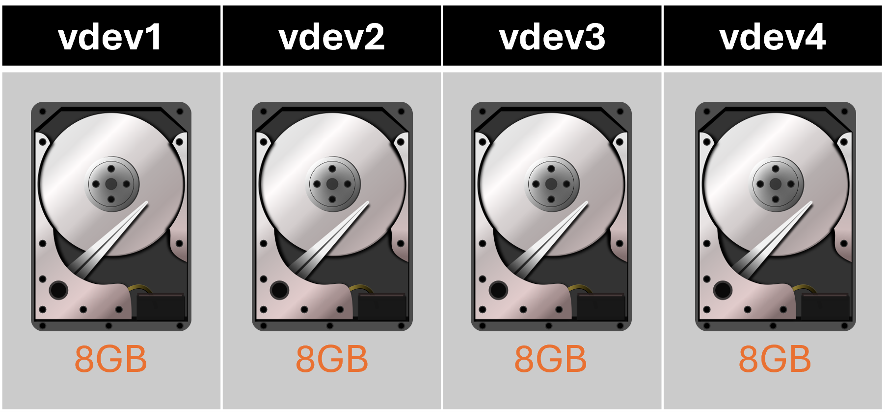

# TrueNAS Scale: Configure stripe disk layout vdev

<b>Description:</b>

Each disk stores data. A stripe requires at least one disk and has no data redundancy.

<b>Requirements</b>

* Atleast 1 disk

<b>Provides:</b>

* No redundancy
* Most storage capacity

<b>Sample 1:</b>

<b>Configuration:</b>

* Width: 4
* Number of VDEVs: 1
* Capacity: 32 GB
* Redundancy: 0 drives

<b>Sample 2:</b>

<b>Configuration:</b>

* Width: 2
* Number of VDEVs: 2
* Capacity: 32 GB
* Redundancy: 0 drives

<b>Sample 2:</b>

<b>Configuration:</b>

* Width: 1
* Number of VDEVs: 4
* Capacity: 32 GB
* Redundancy: 0 drives