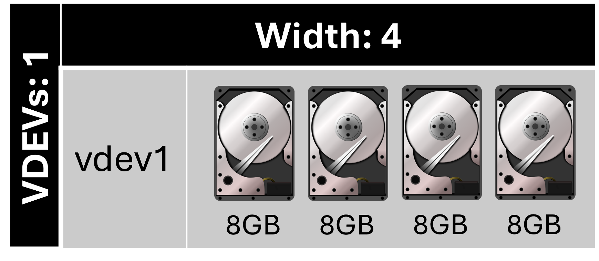
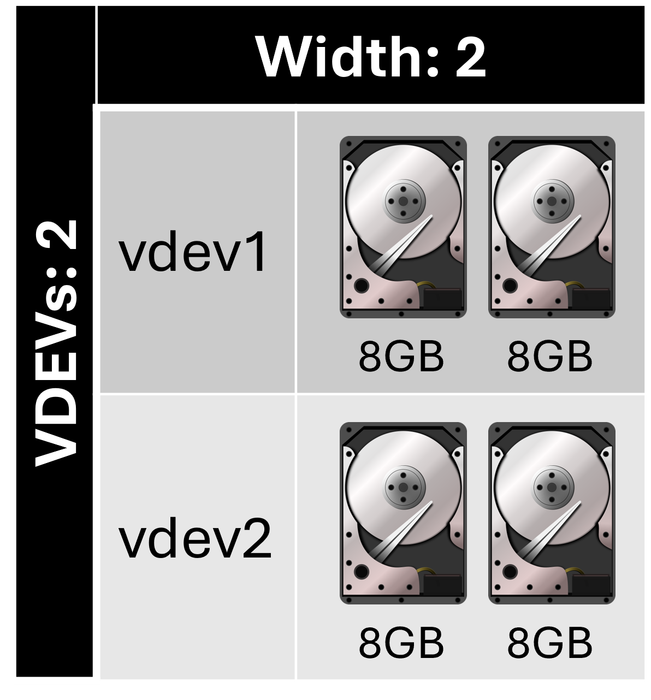
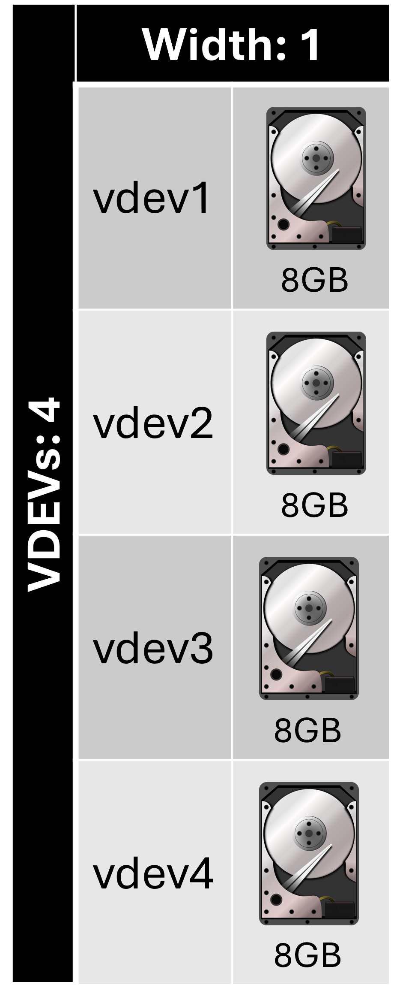

# TrueNAS Scale: Configure stripe disk layout vdev

<b>Description:</b>

Each disk stores data. A stripe requires at least one disk and has no data redundancy.

<b>Requirements</b>

* Atleast 1 disk

<b>Provides:</b>

* No redundancy
* Most storage capacity

<b>Example 1:</b>

<b>Configuration:</b>

* Width: 4
* Number of VDEVs: 1
* Total drives: 4
* Drive capacity: 8 GB
* Capacity: 32 GB
* Redundancy: 0 drives

<b>Example 2:</b>

<b>Configuration:</b>

* Width: 2
* Number of VDEVs: 2
* Total drives: 4
* Drive capacity: 8 GB
* Capacity: 32 GB
* Redundancy: 0 drives

<b>Example 3:</b>

<b>Configuration:</b>

* Width: 1
* Number of VDEVs: 4
* Total drives: 4
* Drive capacity: 8 GB
* Capacity: 32 GB
* Redundancy: 0 drives

# Related videos:

* [TrueNAS Scale playlist](https://www.youtube.com/playlist?list=PLVncjTDMNQ4RKprjwzLtGYUwVLZe6INiH)